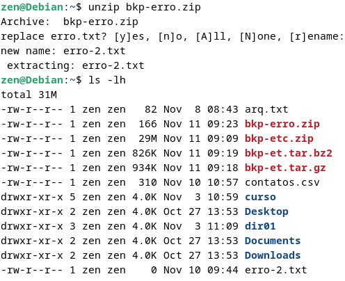
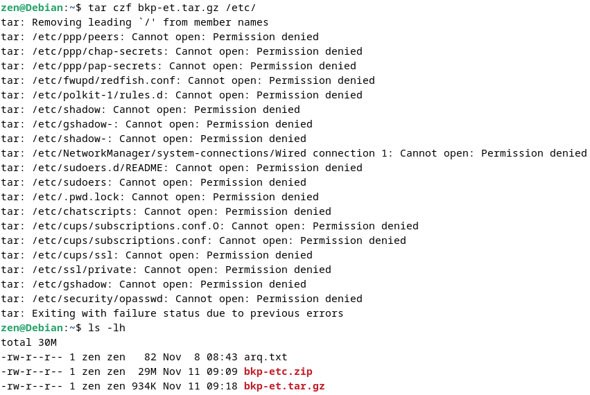
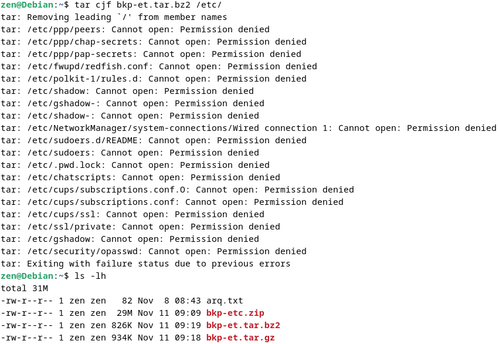
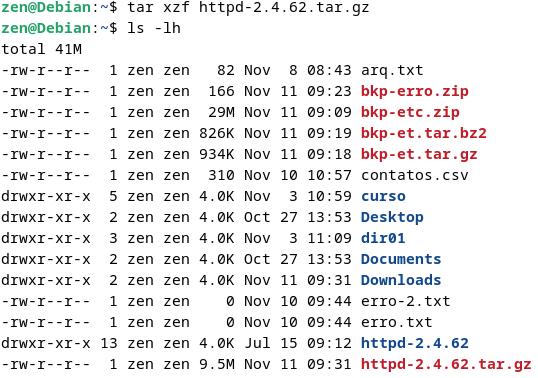

## Empacotadores e Compactadores

Neste módulo aprederemos alguns comandos básicos para compactar e descompactar arquivo no via terminal  

Comando `zip -r` utilizado para compactar arquivos na extensão zip

-------------

Comando `unzip` utilizado para despactar arquivos zip  

-------------

Comando `tar` é mais comum no ambinte Linux e possui algumas vantagens, porém o comando `tar` possui algumas opções importante para sua execução

Segue lista da descrição das opções: 
opção | Descrição
---|---
`c` | Compacta ou empacota em um novo arquivo
`x` | Extrai o conteúdo de um arquivo compactado
`t` | Lista o conteúdo de um arquivo compactado 
`z` | Modo de operação com o comando copactador "gzip" 
`Z` | Modo de operação com o comando copactador "compress"
`j` | Modo de operação com o comando copactador "bzip2" 
`f` | Modo de operação com arquivo

-------------

Comando `tar czf` utilizado para compactar arquivo no modo gzip

-------------

Comando `tar cjf` utilizado para compactar arquivo no modo bzip2

-------------

Comando `tar xzf` utilizado para descompatar arquivo no modo gzip

