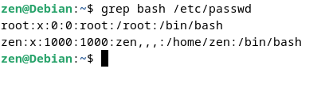

## Filtro de Conteúdo 

A utilização de filtros permite que informações que sejam enviadas para a saída padrão `stdout` apenas as informções relevantes. 

O comando ´grep´ pesquisa em arquivos ou em dua entrada padrão por uma sequência de caracteres informada 

Utilizando o parâmetro `-v` imprime todas as linhas que não tenham a palavra informada

Utilizando a expressão regular `^d` é possível filtrar todas as linhas que comecem com a letra d

-----------------

Comando `wc` permite visulizar a quantidade de linhas, palavras e caracteres em um determinado arquivo

Utilizando o parâmetro `nl` no comando `cat` visualizamos a quantidades de linhas  

-----------------

O comando `cut` faz recorte em um determinado arquivo, sendo o `-d` o delimitador e o `-f` campo

 

-----------------

O comando `awk` é similar ao comando `cat` mostrado anteriormente, 

 