## Comandos para Gerenciamento do Sistema Operacional

Neste módulo aprederemos alguns comandos básicos para coletar informções do sistema 

Comando `uname -a` exibe informções sobre o sistema instalado, incluindo a versão do Kernel

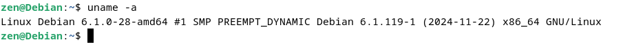

No comando `uname` não é possivel ver a distribuição, para isso existe o caminho `/etc/debian_version ` onde podemos ver qual é a distribuição do Linux

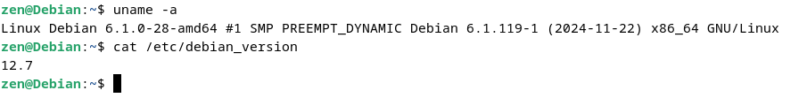

-------------

Comando ` uptime ` através dele podemos ver a hora atual assim como o tempo que o sistema está em execução

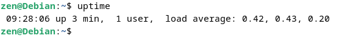

-------------

Comando ` top ` além de exibir quanto tempo a máquina está ligada, exibe também a quantidade de usuários que estão logados e o load average 

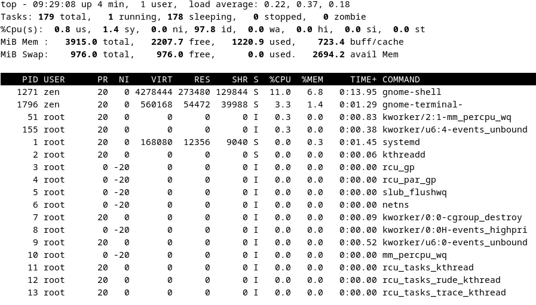

-------------

Comando `free -m` exibe informações sobre a utilização de memória RAM e SWAP

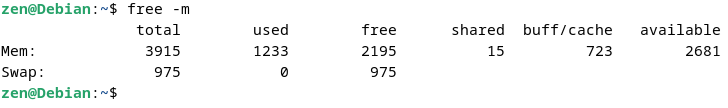

Podemos executar o comando `free -s 2` para atulizar o status a cada 2 segundos

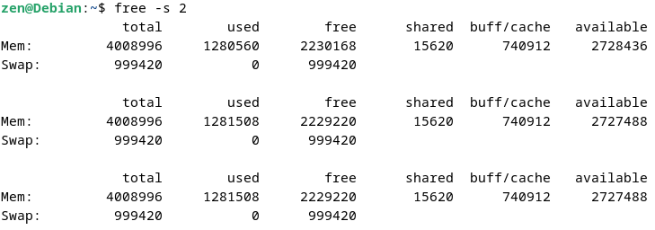

Para obter mais informações sobre o uso de memória, podemos acessar o arquivo `/proc/meminfo `

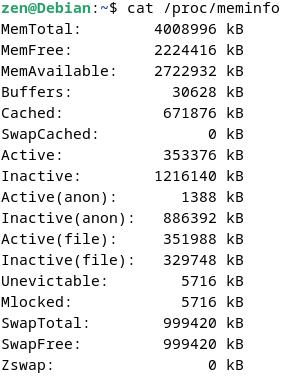

-------------

Comando `df -h` exibe informações sobre o espaço livre/utilizado em disco

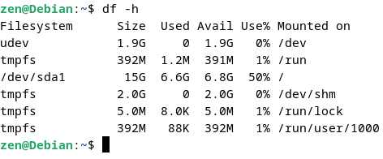

O comando `du` exibe o tamanho ocupado em disco de arquivos e diretórios 

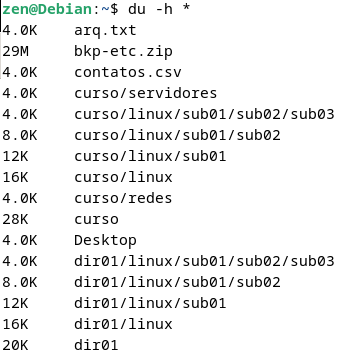

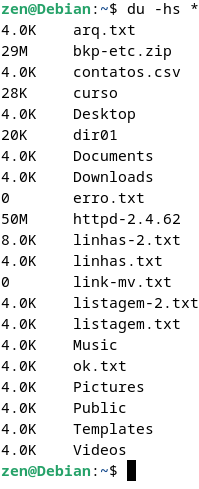

-------------

Comando `file` exibe o tipo de um determinado arquivo

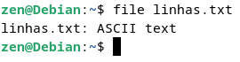

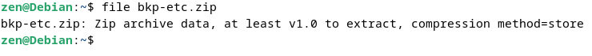

-------------

Comandos `whoami`, `who` e `w` exibe informações de logons

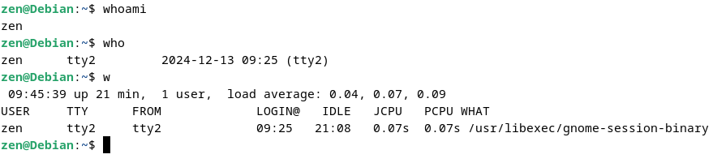