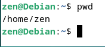
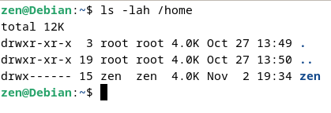
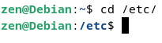
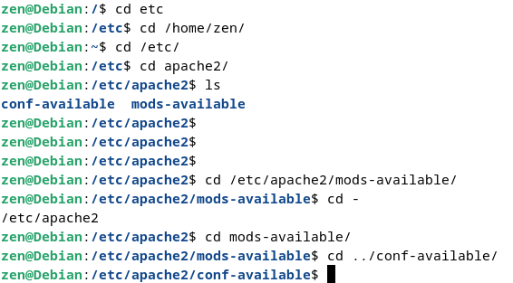
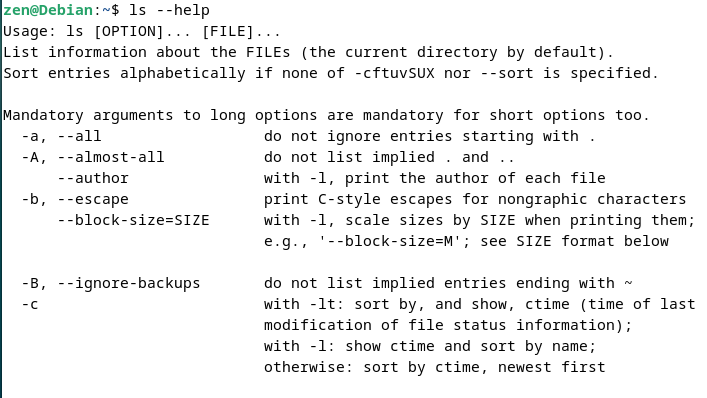

# Administração de Sistemas GNU/Linux

## Introdução ao Shell - comandos básicos

Comando `pwd` exibi caminho do seu diretório atual 
 
 

--------------

Comando `ls` lista arquivos e diretórios 

 

 --------------

 Comando `cd` é utilizado para navegar/entrar nos diretórios(pastas) do sistema operacional 

Comando `cd ..` votal para um nível anterior  

--------------

Comando `man` e info é utilizado para visualizar o manual do comando 

