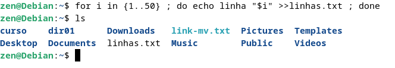
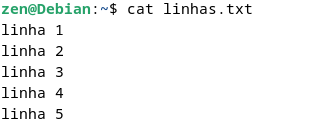
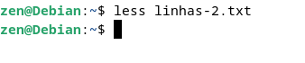
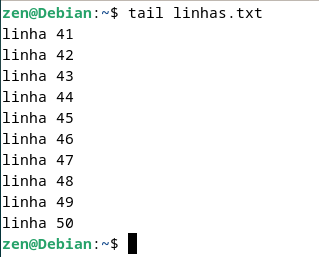
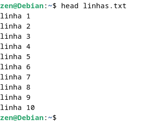
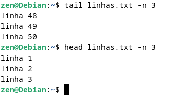
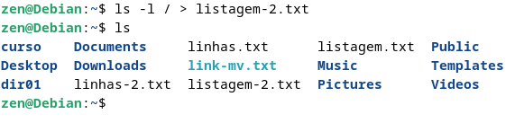
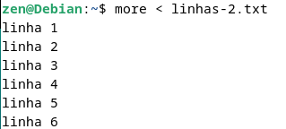
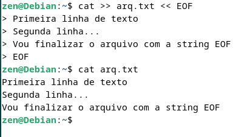

## Manipulação de Conteúdo com comandos Shell

`>>` permite redirecionar a saida para um arquivo, no nosso exemplo estamos denominando o arquivo de linhas.txt

--------------

Comando `cat` permite visuliar o arquivo que criamos atenriormente

--------------

Comando `more` permite visuliar arquivos página-a-página ou linha-a-linha utilizando respctivamente `Space` ou `Enter`

--------------

Comando `less` é o mais recomomentado dentre o que já foi mostrado, é um `more` melhorado pois permite utilizar a naveção de setas

No comando `less` utilizando a `/` é possível realizar pesquisas em um determinado arquivo

--------------

Comandos `tail` e `head` são uteis para visualização de logs, vendo respectivamente o fim e o início de um determinado arquivo de log

Utilizando o argumento `-n` especifico a quantilidade de linhas que quero visulizar no log

--------------

## Redirecionadores

Para utilizar os redirecionadores basta utilizarmos "maior que" `>` ou "menor que" `<`

Redirecionando a saida do comando `ls -l` para o arquivo listagem-2.txt, utilizando `>` sobrescreve, já se utilizarmos `>>` adicionamos ao final do arquivo

--------------

Redirecionadores que tem a função de receber, menor que `<` ou `<<` 

Neste exemplo esteamos fazendo o comando `more` receber o conteúdo de linhas-2.txt

O redirecionador `<<` é utilizado para determinar o final de um "bloco" de dados

