# Administração de Sistemas GNU/Linux

## Introdução ao Shell - comandos básicos

Comando `pwd` exibi caminho do seu diretório atual 
 
 

--------------

Comando `ls` lista arquivos e diretórios 

 

 --------------

 Comando `cd` é utilizado para navegar/entrar nos diretórios(pastas) do sistema operacional 

Comando `cd ..` votal para um nível anterior  

--------------

Comando `man` e info é utilizado para visualizar o manual do comando 

## Manipulação de Arquivos e diretórios

Comando `mkdir` é usado para criar um ou mais diretórios

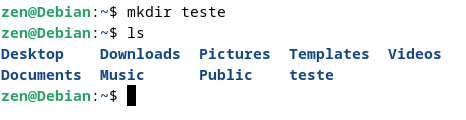

Utilizando o parâmetro `-p` dá para criar subdiretórios

Criando vários diretórios sumultâneamente

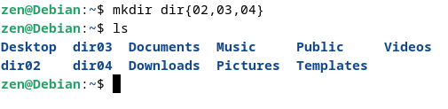

Criando mais de um subdiretório dentro da pasta curso

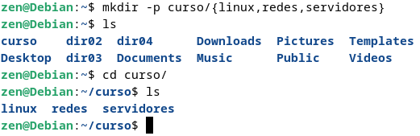

--------------

Comando `rmdir` é usado para remover diretórios vazios

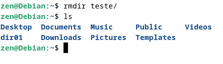

--------------

Comando `rm -r` é usado para remover diretórios que contem arquivos ou subdiretórios dentro do diretório

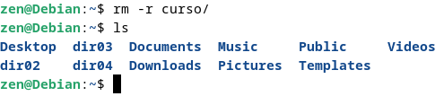

--------------

Teclas `Ctrl` + `R` é usado para pesquisa reversa

--------------

Comando `touch` cria arquivo

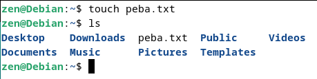

--------------

Comando `mv` é usado para mover arquivos

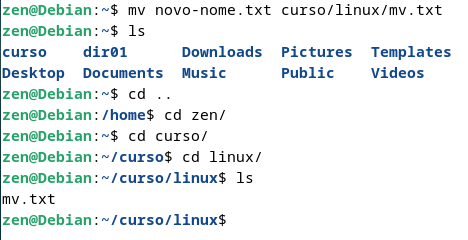

--------------

O comando `cp` é usado para criar uma cópia do conteúdo do arquivo ou diretório especificado

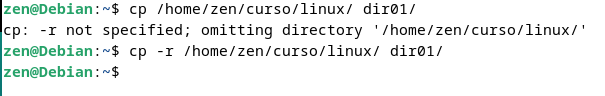

--------------

O comando `ls` é usado para criar links simbólicos

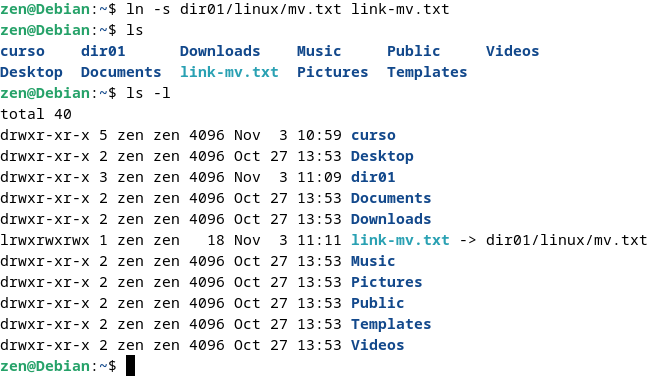

--------------

O comando `find` é usado para localizar arquivos em um determinado diretório

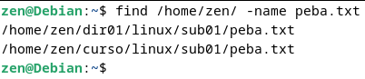

--------------

O comando `du-h` é exibe a quantidade de espaço o cupado por cada diretório

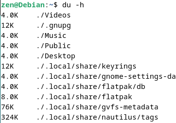

--------------

O comando `tree` lista o conteúdo dos diretórios em formato de árvore

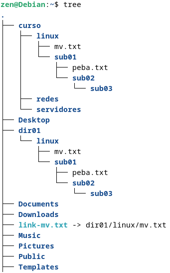

## Manipulação de Conteúdo com comandos Shell

`>>` permite redirecionar a saida para um arquivo, no nosso exemplo estamos denominando o arquivo de linhas.txt

--------------

Comando `cat` permite visuliar o arquivo que criamos atenriormente

--------------

Comando `more` permite visuliar arquivos página-a-página ou linha-a-linha utilizando respctivamente `Space` ou `Enter`

--------------

Comando `less` é o mais recomomentado dentre o que já foi mostrado, é um `more` melhorado pois permite utilizar a naveção de setas

No comando `less` utilizando a `/` é possível realizar pesquisas em um determinado arquivo

--------------

Comandos `tail` e `head` são uteis para visualização de logs, vendo respectivamente o fim e o início de um determinado arquivo de log

--------------

