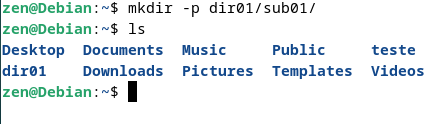
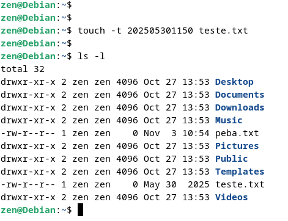

# Administração de Sistemas GNU/Linux

## Introdução ao Shell - comandos básicos

Comando `pwd` exibi caminho do seu diretório atual 
 
 

--------------

Comando `ls` lista arquivos e diretórios 

 

 --------------

 Comando `cd` é utilizado para navegar/entrar nos diretórios(pastas) do sistema operacional 

Comando `cd ..` votal para um nível anterior  

--------------

Comando `man` e info é utilizado para visualizar o manual do comando 

## Manipulação de Arquivos e diretórios

Comando `mkdir` é usado para criar um ou mais diretórios

Utilizando o parâmetro `-p` dá para criar subdiretórios

Criando vários diretórios sumultâneamente

Criando mais de um subdiretório dentro da pasta curso

--------------

Comando `rmdir` é usado para remover diretórios vazios

--------------

Comando `rm -r` é usado para remover diretórios que contem arquivos ou subdiretórios dentro do diretório

--------------

Teclas `Ctrl` + `R` é usado para pesquisa reversa

--------------

Comando `touch` cria arquivo

--------------

Comando `mv` é usado para mover arquivos

--------------

O comando `cp` é usado para criar uma cópia do conteúdo do arquivo ou diretório especificado

--------------

O comando `ls` é usado para criar links simbólicos

--------------

O comando `find` é usado para localizar arquivos em um determinado diretório

--------------

O comando `du-h` é exibe a quantidade de espaço o cupado por cada diretório

--------------

O comando `tree` lista o conteúdo dos diretórios em formato de árvore

